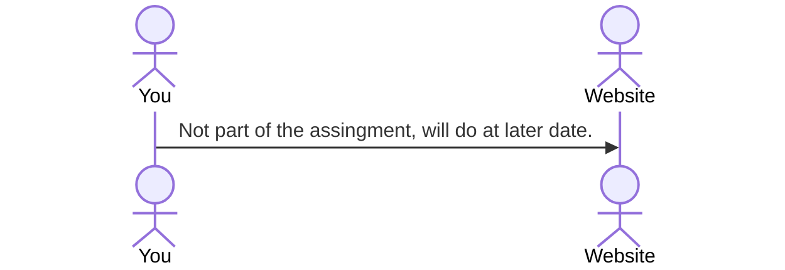

# Commonly

[My Notes](notes.md)

A brief description of the application here. 

> [!NOTE]
>  This is a template for your startup application. You must modify this `README.md` file for each phase of your development. You only need to fill in the section for each deliverable when that deliverable is submitted in Canvas. Without completing the section for a deliverable, the TA will not know what to look for when grading your submission. Feel free to add additional information to each deliverable description, but make sure you at least have the list of rubric items and a description of what you did for each item.

> [!NOTE]
>  If you are not familiar with Markdown then you should review the [documentation](https://docs.github.com/en/get-started/writing-on-github/getting-started-with-writing-and-formatting-on-github/basic-writing-and-formatting-syntax) before continuing.

## 🚀 Specification Deliverable

> [!NOTE]
>  Fill in this sections as the submission artifact for this deliverable. You can refer to this [example](https://github.com/webprogramming260/startup-example/blob/main/README.md) for inspiration.

For this deliverable I did the following. I checked the box `[x]` and added a description for things I completed.

- [x] Proper use of Markdown
- [x] A concise and compelling elevator pitch
- [x] Description of key features
- [x] Description of how you will use each technology
- [x] One or more rough sketches of your application. Images must be embedded in this file using Markdown image references.

### Elevator pitch

Moving into a new apartment is exciting, but keeping everything organized with roommates get stressful. Commonly is a web app that makes shared living easier by centralizing all the essentials: a customizable chores list, shared calendar, and even an interactive house view. It keeps everyone on the same page, reduces miscommunication, and ensures no task or event gets overlooked. With Commonly, living together becomes smoother, more collaborative, and a lot more fun!

### Design

### Key features

- **Smart Chore Management:** Automatically assigns daily, weekly, and monthly chores based off of a customizeable list
- **Progress Tracking:** Easily view your own tasks and see your roommates' progress to keep accountability transparent and friendly
- **Shared Calendar:** Let everyone know what's going on by putting events on the shared calendar
- **Interactive House:** A fun, visual representation that improves as tasks are completed
- **Secure Login:** Keep your personal information safe with secure HTTPS login

### Technologies

I am going to use the required technologies in the following ways.

- **HTML** - Use correct HTML structure for the web application. There will be one main page with multiple other pages linking to different features of the application. 
- **CSS** - Styling that looks fun and inviting, good design for the elements of the page and adequate whitespace.
- **React** - Used to develop the interactive house, calendar, and progress bars. 
- **Service** - Used for logging in and out, calls to a third party API
- **DB/Login** - Store login information securely, chores lists, calendar items, 
- **WebSocket** - Will keep track of progress bars on tasks, calendar updates, and allow for user collaboration.

## 🚀 AWS deliverable

For this deliverable I did the following. I checked the box `[x]` and added a description for things I completed.

- [x] **Server deployed and accessible with custom domain name** - [My server link](https://whitneystirling.com).

## 🚀 HTML deliverable

For this deliverable I did the following. I checked the box `[x]` and added a description for things I completed.

- [x] **HTML pages** - I made five html pages (login, progress tracker, roommate tracker, personal tasks, and a calendar)
- [x] **Proper HTML element usage** - I have proper format for all html tags, including the body, nav, main, header, and footer
- [x] **Links** - In the nav of each website page, there are links to the other pages. The only page not in the nav link list is the roommate tracker, which can be accessed through a linked button in the progress tracker page. 
- [x] **Text** - I have a lot of text for future placeholders with short descriptions about what will go in that spot, and what it will do
- [x] **3rd party API placeholder** - I added a placeholder for a calendar API that I will be implementing
- [x] **Images** - I added an image of a calendar to act as a placeholder for my API, and also to help me get a sense of what it will look like on my page
- [x] **Login placeholder** - The index.html file contains the login portal
- [x] **DB data placeholder** - There is a database placeholder to keep login information stored. There is another placeholder for keeping the chores saved and stored.
- [x] **WebSocket placeholder** - There is a Web Socket placeholder where collaborative chore information is shared, making sure that everyone is up to date on what tasks have been completed. 

## 🚀 CSS deliverable

For this deliverable I did the following. I checked the box `[x]` and added a description for things I completed.

- [x] **Header, footer, and main content body** - I changed this so that it's similar across all pages. Pages have a blue background with white boxes to contain elements. 
- [x] **Navigation elements** - All the links work, and there is a nice navigation bar spanning the top of the page. 
- [x] **Responsive to window resizing** - I added flex elements so that the website will be responsive to window resizing.
- [x] **Application elements** - I have good contrast with my elements and make sure that there's plenty of repetition on the nav bar.
- [x] **Application text content** - Fonts are the same across pages. 
- [x] **Application images** - I still have the image of my calendar that is serving as a placeholder for my API.

## 🚀 React part 1: Routing deliverable

For this deliverable I did the following. I checked the box `[x]` and added a description for things I completed.

- [x] **Bundled using Vite** - I bundled and configured this deliverable using Vite
- [x] **Components** - I added components to the .jsx pages and made sure that all the links and functions worked correctly.
- [x] **Router** - I routed all my functions on the app.jsx page so that links would work and all my pages were accessible.

## 🚀 React part 2: Reactivity deliverable

For this deliverable I did the following. I checked the box `[x]` and added a description for things I completed.

- [x] **All functionality implemented or mocked out** - I mocked out the roommate tracker progress, but I implemented functionality for adding tasks to the My Tasks and the Progress Tracker. I also implemented the login part so that you can log in and out. Everything is saved in local storage. 
- [x] **Hooks** - Uses useState and useEffect

## 🚀 Service deliverable

For this deliverable I did the following. I checked the box `[x]` and added a description for things I completed.

- [ ] **Node.js/Express HTTP service** - I did not complete this part of the deliverable.
- [ ] **Static middleware for frontend** - I did not complete this part of the deliverable.
- [ ] **Calls to third party endpoints** - I did not complete this part of the deliverable.
- [ ] **Backend service endpoints** - I did not complete this part of the deliverable.
- [ ] **Frontend calls service endpoints** - I did not complete this part of the deliverable.
- [ ] **Supports registration, login, logout, and restricted endpoint** - I did not complete this part of the deliverable.

## 🚀 DB deliverable

For this deliverable I did the following. I checked the box `[x]` and added a description for things I completed.

- [ ] **Stores data in MongoDB** - I did not complete this part of the deliverable.
- [ ] **Stores credentials in MongoDB** - I did not complete this part of the deliverable.

## 🚀 WebSocket deliverable

For this deliverable I did the following. I checked the box `[x]` and added a description for things I completed.

- [ ] **Backend listens for WebSocket connection** - I did not complete this part of the deliverable.
- [ ] **Frontend makes WebSocket connection** - I did not complete this part of the deliverable.
- [ ] **Data sent over WebSocket connection** - I did not complete this part of the deliverable.
- [ ] **WebSocket data displayed** - I did not complete this part of the deliverable.
- [ ] **Application is fully functional** - I did not complete this part of the deliverable.
